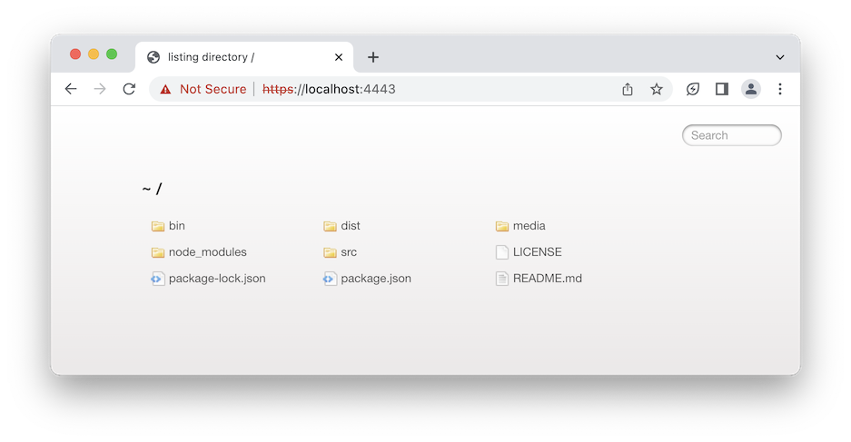

# Local HTTPS Server

This is a Node.js command-line tool that allows you to run a simple HTTP or HTTPS server to serve static files from a specified folder.



## Installation

Make sure you have Node.js installed on your machine. Then, follow these steps:

```bash
npm install --global local-https-server
```

or

```bash
yarn global add local-https-server
```

or

```bash
pnpm add -g local-https-server
```

## Usage

To start the server, run the following command:

```bash
local-https-server [path] [options]
```

Replace `[path]` with the path to the folder containing the files you want to serve. If no path is specified, the server will serve files from the current directory.

### Options

- `-a, --host`: Specify the host address (default: localhost).
- `-p, --port`: Specify the port number (default: 4443).
- `-S, --tls, --ssl`: Enable secure request serving with TLS/SSL (HTTPS). If no SSL certificate is provided, a self-signed SSL certificate will be created (default: true).
- `-C, --cert`: Path to the TLS cert file.
- `-K, --key`: Path to the TLS key file.
- `-h, --help`: Print the list of options and exit.
- `-v, --version`: Print the version of the tool and exit.

### SSL Passphrase Environment Variable

You can provide a passphrase for the SSL key using the `NODE_HTTP_SERVER_SSL_PASSPHRASE` environment variable. This variable is used when generating or using a custom SSL certificate. Set the `NODE_HTTP_SERVER_SSL_PASSPHRASE` environment variable to the desired passphrase before starting the server.

Example:

```bash
export NODE_HTTP_SERVER_SSL_PASSPHRASE="your-ssl-passphrase"
local-https-server
```

## Examples

1. Start the server and serve files from the current directory over HTTPS:

```bash
local-https-server
```

**Note: To access your localhost during development, manually approve the [connection by overriding any warnings and navigating](./docs/your-connection-is-not-private.md) to "https://localhost:4443/".**

2. Start the server and serve files from a specific folder (`public`) over HTTP:

```bash
local-https-server public -S false
```

3. Start the server on a custom host and port:

```bash
local-https-server -a 0.0.0.0 -p 8080
```

**[Solve 'EADDRNOTAVAIL' Error by Modifying the Hosts File](./docs/eaddrnotavail.md)**

## License

This project is licensed under the MIT License. See the [LICENSE](./LICENSE) file for details.

## Acknowledgments

This tool is built using the following open-source libraries:

- [node-forge](https://github.com/digitalbazaar/forge)
- [minimist](https://github.com/substack/minimist)
- [express](https://www.npmjs.com/package/express)
- [serve-index](https://www.npmjs.com/package/serve-index)
- [cors](https://www.npmjs.com/package/cors)
- [morgan](https://github.com/expressjs/morgan)

## Contributing

Contributions are welcome! Please fork the repository and

submit a pull request.

If you encounter any issues or have suggestions for improvement, please open an issue.

## Frequently Asked Questions

- _Can this server be accessed over the internet?_ **No.**
- _Is it permissible to utilize this project in production environments?_ **Certainly not.**
- _Does this server possess the capability to execute php, ruby, python, or any other cgi script?_ **No.**
- _Is this server adequately prepared to handle thousands of requests?_ **Ideally, no.**

## Author

[Muhammad Soban](https://www.linkedin.com/in/soban1193/)

## Contact

For any questions or suggestions, please feel free to reach out to [soban1193@gmail.com](mailto:soban1193@gmail.com).
