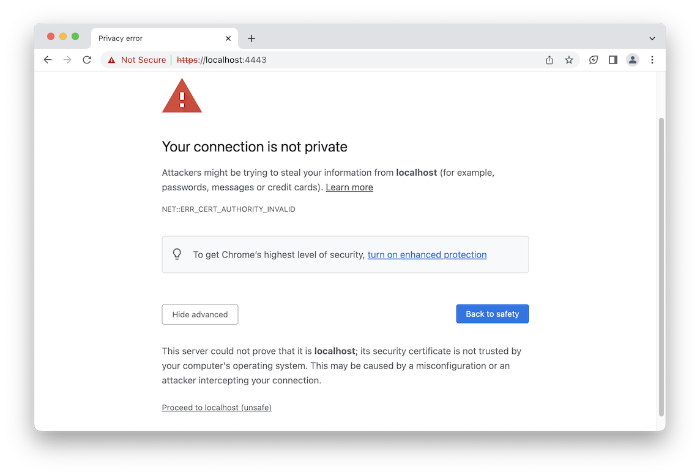

# Your Connection is Not Private - NET::ERR_CERT_AUTHORITY_INVALID

## Introduction

This README provides documentation for the error message "Your connection is not private" with the specific error code "NET::ERR_CERT_AUTHORITY_INVALID." This error occurs when you are trying to access a website or service running on your local machine (localhost) using HTTPS, but the SSL certificate used is not trusted by your browser.

The purpose of this document is to guide you through the steps to manually approve the connection and override the warning, allowing you to access the desired service on your localhost during development.

## Error Message

When encountering this error, you will see a message similar to the following in your web browser:

```
Your connection is not private
Attackers might be trying to steal your information from localhost (for example, passwords, messages, or credit cards). Learn more
NET::ERR_CERT_AUTHORITY_INVALID
```



## Solution

To resolve the "NET::ERR_CERT_AUTHORITY_INVALID" error and manually approve the connection, follow the steps below:

1. Open your web browser and navigate to the following URL: `https://localhost:4443/` (replace `localhost:4443` with the appropriate address or port of the service you are trying to access).

2. When you attempt to access the URL, your browser will display an error page with the "Your connection is not private" message.

3. To override the warning and manually approve the connection, follow the browser-specific instructions provided below:

- **Google Chrome**: Click on the "Advanced" link on the error page, then click on the "Proceed to localhost (unsafe)" link.

- **Mozilla Firefox**: Click on the "Advanced" button on the error page, then click on the "Accept the Risk and Continue" button.

- **Microsoft Edge**: Click on the "Details" link on the error page, then click on the "Go on to the webpage (Not recommended)" link.

- **Safari**: Click on the "Show Details" button on the error page, then click on the "visit this website" link.

4. After manually approving the connection, your browser will allow you to access the desired service on your localhost.

## Note

Keep in mind that manually approving the connection and overriding the warning allows you to access the service on your localhost, but it also means that your browser is no longer verifying the SSL certificate. This can expose you to potential security risks, so it is recommended to use this approach only during development and testing phases.

## Conclusion

This documentation has provided instructions on how to resolve the "NET::ERR_CERT_AUTHORITY_INVALID" error, allowing you to access services on your localhost during development. By manually approving the connection, you can override the warning and proceed to the desired page. Remember to exercise caution and restore SSL certificate verification in production environments to ensure secure browsing.
